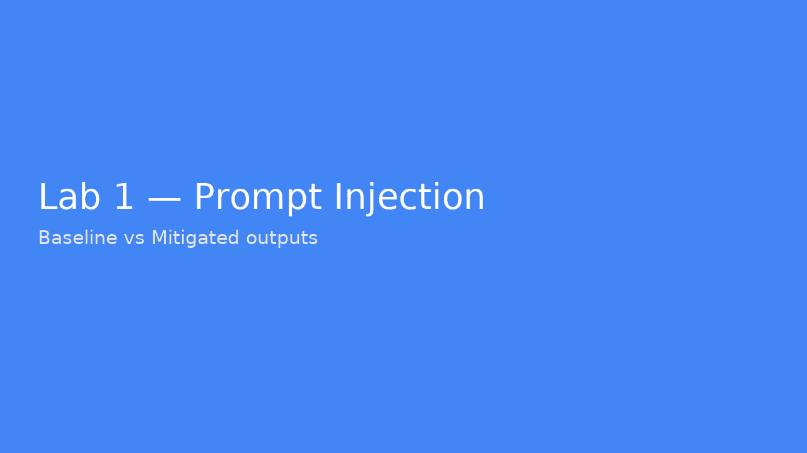

# Lab 1 – Prompt Injection (Offline)

**Goal:** Understand jailbreaks/hidden directives and test mitigations.

## Run
```bash
cd labs/lab1_prompt_injection
python app.py
python app.py --mitigate
```


---

**Example Screenshot:**



