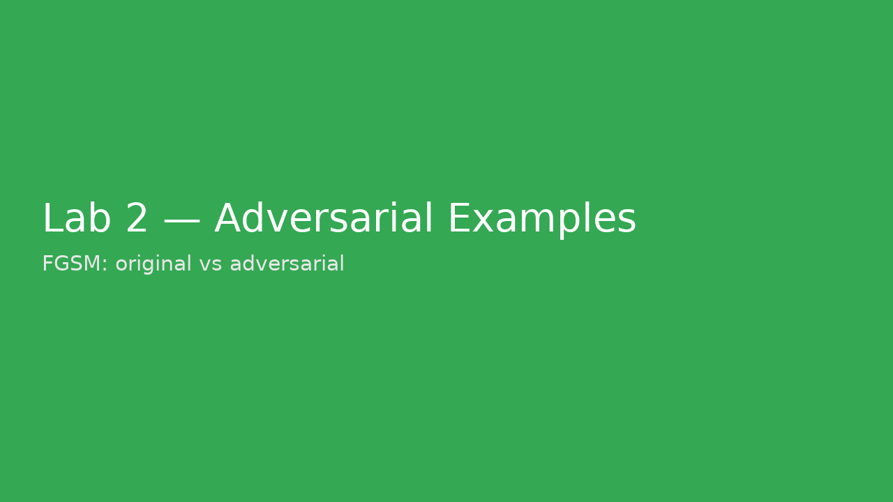

# Lab 2 – Adversarial Examples (Digits, NumPy + FGSM)

**Goal:** Generate adversarial examples that change a classifier’s decision.

## Run
```bash
cd labs/lab2_adversarial_examples
python adversarial_digits.py --epsilon 0.5
```


---

**Example Screenshot:**



