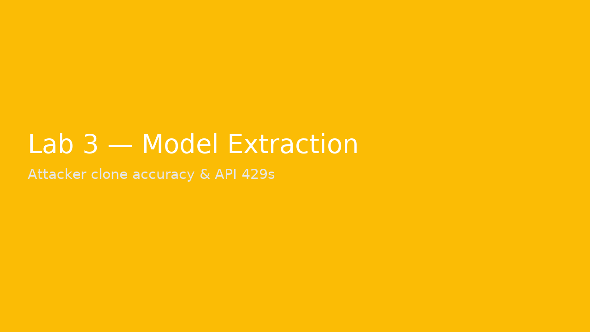

# Lab 3 – Model Extraction (Iris API + Attacker)

**Goal:** Approximate a model via API; then mitigate with API key, rate limiting, and reduced outputs.

## Run
```bash
cd labs/lab3_model_extraction
python server.py
python attacker_extract.py --n 2000 --outfile stolen.csv
python mitigate_server.py --api-key SECRET123 --rate 5
python attacker_extract.py --url http://127.0.0.1:8000/predict --api-key SECRET123 --n 2000
```


---

**Example Screenshot:**



