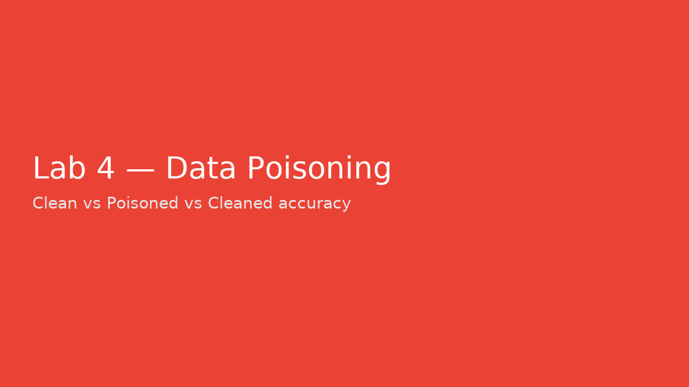

# Lab 4 – Data Poisoning Detection (Synthetic, Offline)

**Goal:** Detect malicious labels/outliers; retrain and compare accuracy.

## Run
```bash
cd labs/lab4_data_poisoning
python poisoning_demo.py --poison 0.1 --contamination 0.1
```


---

**Example Screenshot:**



